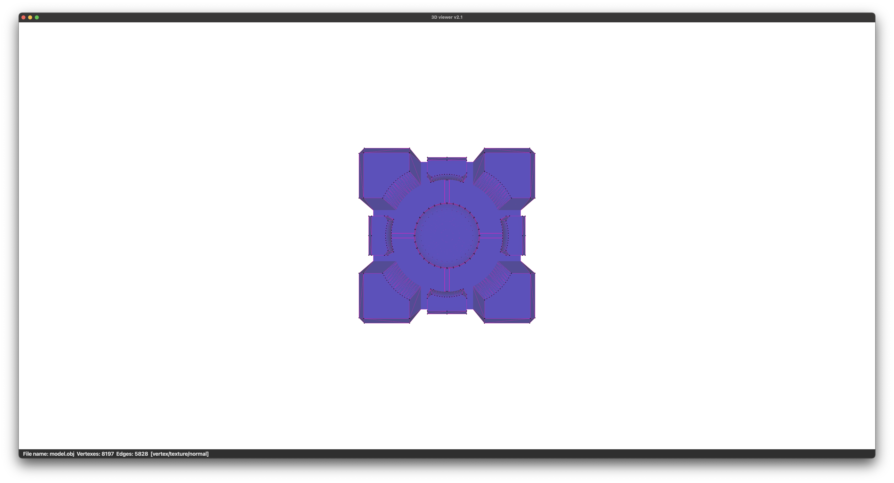
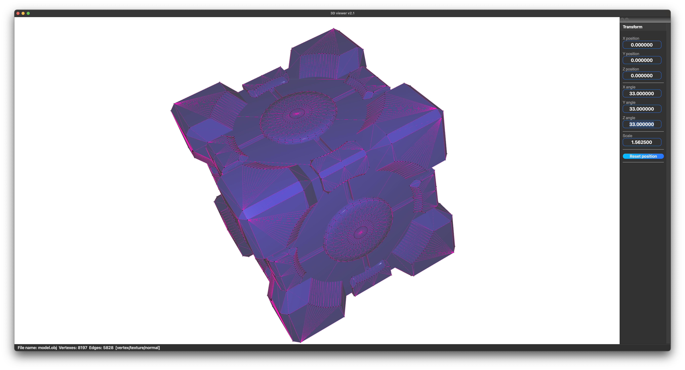
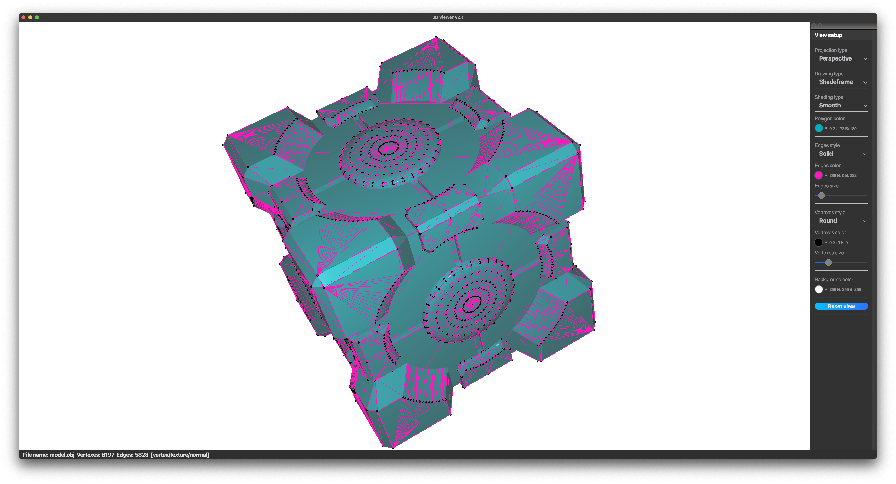
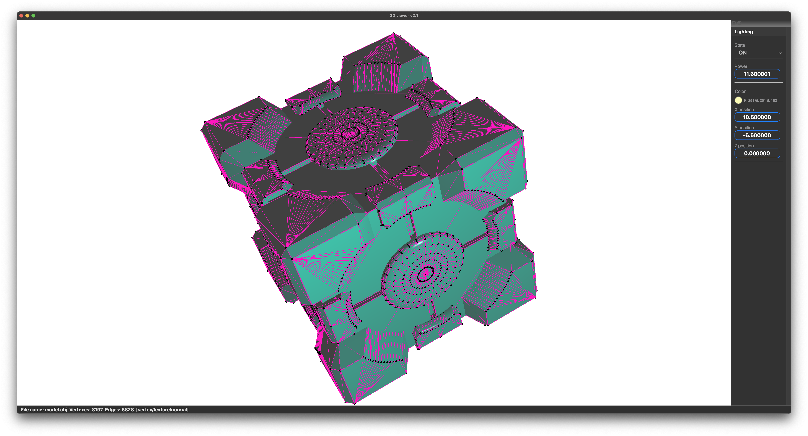
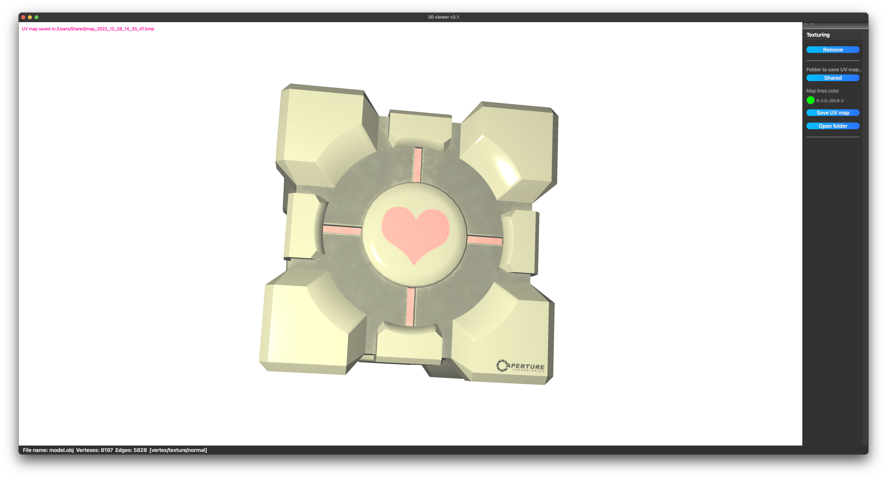
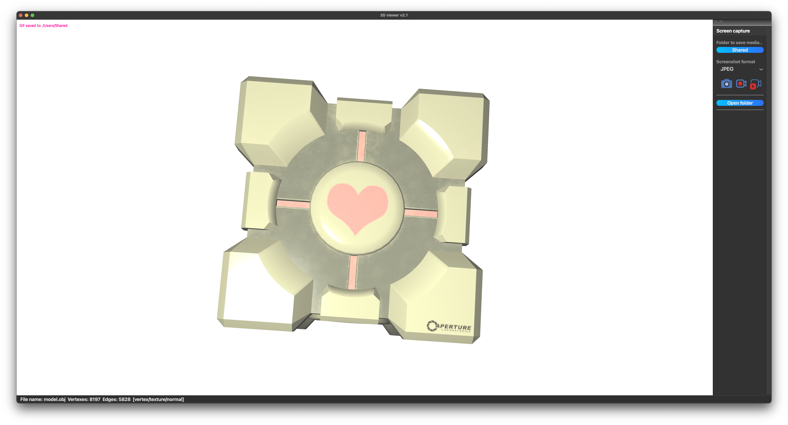

# 3DViever_v2.1
3DViever to show .obj files

## Short app description

The application is to draw 3d models in wireframe, shaded, shadeframe view. The only one model can be loaded at the one time. As well, it is possible to rotate, move, scale model by 3 axes (X, Y and Z), and so on.

The application developed in C++ language. As a GUI creation technology chosen QT6 library with C++ underneath. The application source code located in the src folder and can be built with Makefile which contains standard set of targets for GNU-programs: all, install, uninstall, clean, dvi, dist, tests.

## Interface

### The application interface includes:

1. View port: The main field of window where 3d model is to draw. Open new model can be executed by short-key (command + O) or from menubar (File -> Open new file).

2. Steer panel: To open it is possible by short-key (commad + P) or from the menubar (View -> Steer panel). Steer panel may contains 5 widgets to manage model drawn which can be shown or hidden. Tt is possible to manage these widgets by menubar.
    - View -> Transform (command + 1) - to steer model position in view port (scale, XYZ position and angle).  
    - View -> View setup (command + 2) - to steer model style. Here, can be set projection type (perspective, orthogonal), drawing type (wireframe, shaded, shadeframe), shading type (shade, smooth), polygon color (untextured body color), edges style (solid line, stipple line, color, size), vertexes style (round point, square point, none, color, size), background color.  
    - View -> Lightning (commad + 3) - to manage lightning at scene. Here can be switched on/off light, set its power, color and XYZ position.  
    - View -> Texturing (commad + 4) - to add texture to model that have texture and normals coordinates. Here possible to add/remove texture and build UV map. To save UV map it is necessary to choose folder to save, color map lines and press "Save UV map" button. Then possible to open chosen directory to find saved map.  
    - View -> Screen (command + 5) - to take screenshot, record a GIF or record short screencast of rotatin model by Y axis. Here can be set folder to save media content and button to open this folder.  

Steer panel implemented as dock-widget, so there is possibility to undock it from main window and move around display.

### Steering model by mouse: 

Steering model by mouse: model can be rotated by mouse just with pressed left mouse button, scaled by just mouse wheel. Also, model can be moved by mouse with pressed left mouse button and space key simultaneously by X and Y axis and by space key simultaneously and wheel by Z axis.

## Instruction

To install the application the "make install" command execution is required in "src" folder. The application to launch will be located in "build" folder of the project root.

Uninstallation is done through execution "make uninstall" command. Thus, the executable file will be deleted from "build" folder.